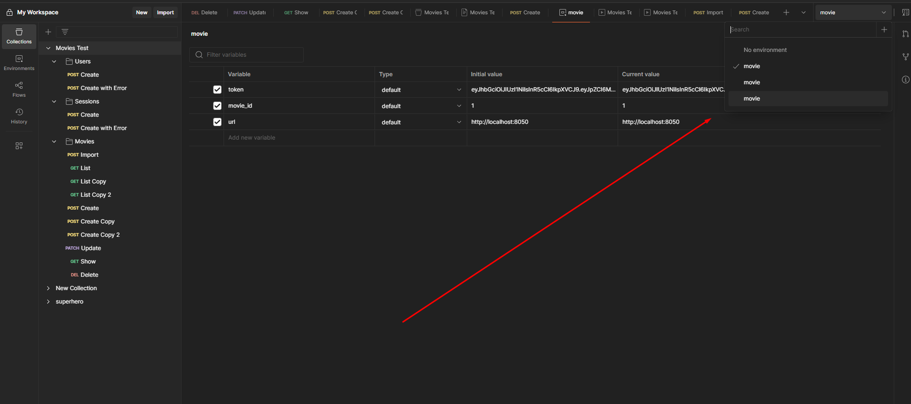

# Тестове завдання для WebbyLab
---
## Зміст

* [1. Як Запустити Проєкт](#1-як-запустити-проєкт)
    * [1.1. Встановлення Залежностей](#11-встановлення-залежностей)
    * [1.2. Запуск Застосунку](#12-запуск-застосунку)
    * [1.3. Docker-Image](#13-запуск-Docker-Image)
* [2. Опис Принципів роботи та Архітектури](#2-опис-проєкту-та-архітектури)
    * [2.1. Шлях Запиту (Request Flow)](#21-шлях-запиту-request-flow)
    * [2.2. Архітектура та Відповідальності Компонентів](#22-архітектура-та-відповідальності-компонентів)
        * [app/](#app)
        * [routes/](#routes)
        * [middlewares/](#middlewares)
        * [controllers/](#controllers)
        * [services/](#services)
        * [models/](#models)
        * [utils/](#utils)
        * [config/](#config)
        * [types/](#types)
        * [schemas/](#schemas)
* [3. Покрокова інструкція як запустити тестування в Postman](#3-опис-запуску-тестувань)
* [4. Що додав з незазначеного в ТЗ](#4-опис-додаткового-функціоналу)
* [5. Правки після Фідбеку](#5-опис-правок-після-фідбеку)
---

## 1. Як Запустити Проєкт

Розділ з інструкцією по запуску


### 1.1. Встановлення Залежностей

Клонуйте репозиторій та встановіть всі необхідні залежності проєкту:

```bash
git clone <https://github.com/P0rtOs/WEB-TEST3.git>
cd </WEB-TEST3/server>
npm install # Або 'yarn install', якщо ви використовуєте Yarn
```
### 1.2. Запуск Застосунку
```bash
npm run dev # Або 'yarn run dev'
```

### 1.3. Запуск Docker-image

Для кращого тестування сервер в контейнері працюватиме на тому ж порті що й його консольний запуск

```bash
docker run --name movies -p 8000:8050 -e APP_PORT=8050 portosr/movies
```

## 2. Опис Проєкту та Архітектури

Цей розділ детально описує внутрішню структуру проєкту, шлях обробки запитів та відповідальності кожного компонента.

### 2.1. Шлях Запиту (Request Flow)

Для кращого розуміння, ось послідовність, за якою HTTP-запит проходить через застосунок:

1.  **`app/`**: Тут відбувається **ініціалізація** Express-застосунку, підключення до бази даних та налаштування всіх основних middleware. Запит надходить сюди першим.
2.  **`routes/`**: Запит перенаправляється до відповідного маршруту, який відповідає URL запиту. Тут відбувається опис ендпоінтів та їх зв'язок з middleware та контролерами.
3.  **`middlewares/`**: Перед тим, як потрапити до контролера, запит може пройти через один або кілька middleware-функцій. Вони виконують базові перевірки (наприклад, валідацію, автентифікацію) і, у разі успіху, передають запит далі. У випадку помилки, middleware може самостійно сформувати відповідь.
4.  **`controllers/`**: Контролер отримує вже оброблений запит від middleware. Його основна роль – передати запит до відповідного **сервісу** для бізнес-логіки. Отримавши відповідь від сервісу, контролер **формує HTTP-відповідь (JSON-респонс)** згідно з ТЗ.
5.  **`services/`**: Сервіс відповідає за виконання **бізнес-логіки**. Він парсить, обробляє дані, виконує необхідні розрахунки та, за потреби, взаємодіє з **моделями** для роботи з базою даних.
6.  **`models/`**: Модель є інтерфейсом для взаємодії з базою даних, тільки вона може до неї звертатись. Після отримання даних від БД, запит повертається: `модель` -> `сервіс` -> `контролер` -> `клієнт`.

### 2.2. Архітектура та Відповідальності Компонентів

Цей розділ детально описує відповідальності та зміст каталогів.

#### app/
([Дивитись код у папці `app/`](./server/src/app.ts))

* **Відповідальність:** Ініціалізація Express-застосунку, виклик конфігурації бд, логера. Запит завжди спочатку потрапляє сюди, звідки і потрапляє в **router**

#### routes/
([Дивитись код у папці `routes/`](./server/src/routes/))

* **Відповідальність:** Визначення всіх API-ендпоінтів застосунку. Кожен файл у цій папці відповідає за групу маршрутів (наприклад, `userRoutes.ts`, `movieRoutes.ts`). Тут маршрути пов'язуються з відповідними middleware та контролерами.

#### middlewares/
([Дивитись код у папці `middlewares/`](./server/src/middlewares/))

* **Відповідальність:** Містить прості **middleware-функції**, тобто **глобальні обробники помилок**.

#### validation/
([Дивитись код у папці `middlewares/validation/`](./server/src/validation/))

* **Відповідальність:** Цей підкаталог містить middleware для **валідації вхідних даних** (для користувачів, фільмів тощо) за допомогою `Zod-схем`. У разі провалу валідації, цей middleware самостійно формує response з помилкою, і запит **не доходить до контролера**.
* Також тут відбувається **перевірка токена автентифікації**. Це місце, де можна реалізувати логіку обробки різних ролей користувачів. Усі допоміжні функції для обробки токенів знаходяться у [`utils/TokenFunctions.ts`](./server/src/utils/TokenFunctions.ts).

#### controllers/
([Дивитись код у папці `controllers/`](./server/src/controllers/))

* **Відповідальність:** Обробка HTTP-запитів після їх валідації. Основна функція контролера – **делегувати бізнес-логіку сервісам** та **формувати HTTP-відповідь (JSON-респонс)** на основі даних, отриманих від сервісів, відповідно до визначеного ТЗ.

#### services/
([Дивитись код у папці `services/`](./server/src/services/))

* **Відповідальність:** Реалізація **бізнес-логіки** застосунку. Тут відбуваються основні операції: обробка даних, маніпуляції з даними та інше.
За потреби сервіс передає отримані дані в **модель**.

#### models/
([Дивитись код у папці `models/`](./server/src/models/))

* **Відповідальність:** Взаємодія з **базою даних**. Кожен файл у цій папці представляє **модель даних** (таблицю в БД), відповідає за **ініціалізацію таблиць** та їхніх **зв'язків** за допомогою ORM. Будь-які прямі запити до БД повинні відбуватися через методи відповідної моделі і **ніяк інакше**.

#### utils/
([Дивитись код у папці `utils/`](./server/src/utils/))

* **Відповідальність:** Містить допоміжні функції та об'єкти, що використовуються в різних частинах застосунку. Сюди входять:
    * **Об'єкти логера**: Використовуються для централізованого логування подій та помилок.
    * **Допоміжні функції**: Функції, які могли б бути в сервісах, але винесені в окремі файли через їхній розмір або повторюваність, для покращення читабельності коду.

#### config/
([Дивитись код у папці `config/`](./server/src/config/))

* **Відповідальність:** Управління конфігурацією застосунку.
    * **`index.ts`**: Файл, який відповідає за читання всіх змінних середовища з `.env` та надання їх застосунку.
    * **`.database.ts`**: Файл(и) для ініціалізації ORM (Sequelize) та налаштування підключення до бази даних.

#### types/
([Дивитись код у папці `types/`](./server/src/types/))

* **Відповідальність:** Визначення всіх необхідних **Data Transfer Objects** та інших TypeScript-типів. Тут описується, як виглядають дані:
    * При передачі в запиті (тіло запиту, параметри).
    * При збереженні в базі даних.
    * Як виглядають дані, що повертаються API.
    * Також тут описуються типи для **Query параметрів** HTTP-запитів.

#### schemas/
([Дивитись код у папці `schemas/`](./server/src/schemas/))

* **Відповідальність:** Містить **Zod-схеми**, які використовуються для **валідації** вхідних даних. Наприклад, перевірка довжини пароля, наявності '@' в полі імейлу. Ці схеми використовуються в middleware для забезпечення цілісності та безпеки даних.


---

## 3. Опис запуску тестувань
* **Потрібно імпортувати колекцію Postman**: Ви можете завантажити її за цим посиланням: [Collection Link](https://documenter.getpostman.com/view/40435528/2sB2xFfo2G)
* **Вручну виставити Environment `movie`**: На жаль, Postman іноді не встановлює це автоматично. Будь ласка, переконайтесь, що обрано потрібне середовище.
    
* **Вручну вставити файл у запиті для імпорту файлів**: Postman не дозволяє автоматизувати цей крок для завантаження файлів.
    
* **Далі можна по-порядку запускати запити зверху вниз**: Зверніть увагу, що автоматичне тестування Postman може мати (`undefined behavior`), тому рекомендується запускати запити послідовно. Всі тести базуються на файлі який ми імпортуємо для заповнення бд ([Дивитись зміст файлу `sample_movies.txt`](./sample_movies.txt))


---

## 4. Опис додаткового функціоналу

1.  **`validation/`**: Тут додатковий шар перевірки фільмів та користувачів на унікальність та правельність введених даних
2.  **`utils/logger`**: Тут логування за допомогою **winston**, якщо не змінювати .env, то кожен новий запуск серверу буде створювати нову папку в папці ([`Log`](./server/logs)) та записувати туди дані з автоматичних логерів express, sequelize та кастомно створені логи які прописані в services. Також ці логи можна вимкнути, або ввімкнути їх дублювання в консоль (без ввімкнення дублювання не працюватиме), для цього потрібно змінити ([`.env`](./server/.env)).
3.  **`Тестування в постман`**: Вищеописане тестування в постман хай і вийшло не дуже якісним, і не дуже автоматизованим (планувалось щось типу автоматичного E2E як в newman - натис 1 кнопку і отримав результат), проте все ж було цікаво розбиратись з його налаштуваннями.

---

## 5. Опис правок після фідбеку

1.  **Унікальність назви**: Тепер перевірка на унікальність назви фільму реалізована у спеціальній [`функції в сервісі`](./server/src/services/movies.service.ts) (`isExactMovieDuplicate`). Ця перевірка є **однаковою для всіх операцій**, які можуть додавати або оновлювати дані про фільми. Була додана **перевірка з урахуванням регістру**, тобто при перевірці актори "А" та "а" тепер вважатимуться однаковими і впливають на перевірку унікальності.

2.  **Валідація полів (2, 3, 5, 6, 10)**: Всі зміни, пов'язані з валідацією вхідних даних, були проведені у відповідних файлах з [`Zod-схемами`](./server/src/schemas).

3.  **Обробка помилок (4)**: Було продумано більше ймовірних шляхів запиту (`Request Flow`), що дозволило додати **більше конкретизованих помилок**. Це включає й описану проблему з завантаженням файлів неправильного розширення.

4.  **Сортування (7, 8, 9)**: Тепер для сортування даних реалізовано **власну функцію в сервісі**. Це було необхідно, оскільки SQLite має дуже обмежену підтримку кирилиці (навіть якщо працює, вона `case-sensitive`). Усі описані проблеми з сортуванням були виправлені. Тепер сортування повністю **регістронезалежне (`case insensitive`)**, але варто зазначити, що однакові літери кирилиці та латиниці все ще вважаються різними символами, та латиниця завжди буде відображатись після кирилиці(таку поведінку я вважаю очікуваною, але за бажанням це легко змінити)


## 5. На цьому все,хто б це не читва, дякую за те, що приділили час перевірці і пам'ятайте: 
